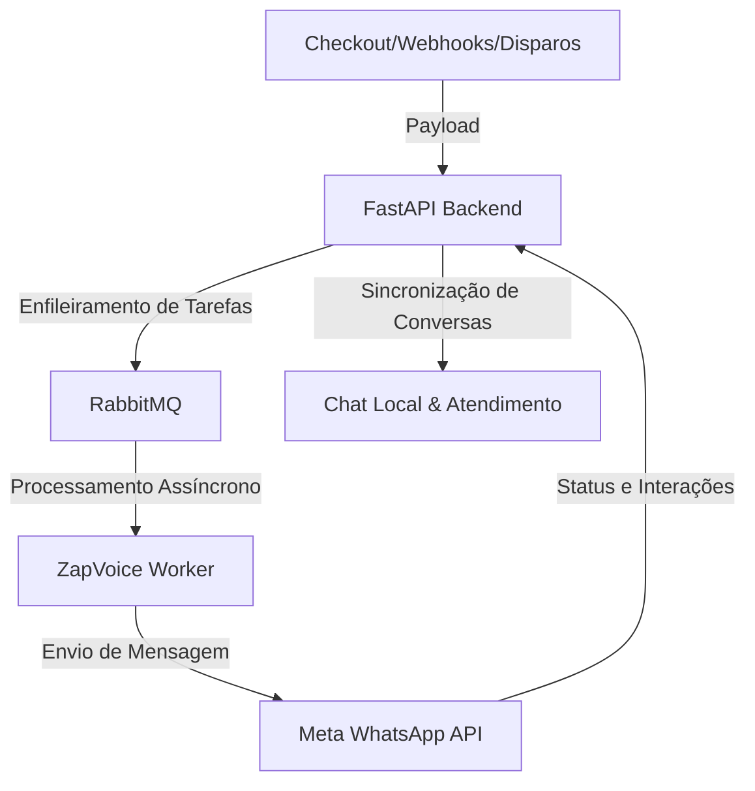

# ⚡ ZapVoice - Automação WhatsApp API Oficial (v2.1.0 — Versão Estável)

Versão estável com **Kanban de Vendas & CRM Multi-Produtos (Pipelines segmentados por curso/produto com valor de venda padrão, movimentação Drag & Drop com auto-scroll horizontal contínuo e adição direta via Chat)**, **Filtros Temporais para Disparos Recorrentes (Segmentação por data de criação ou última interação nos últimos 7, 14, 30, 60 ou 90 dias)**, **Auditoria de Segurança Integrada (pip-audit + npm audit 100% livres de vulnerabilidades)** e **Modularização Completa de Clean Code**.

O **ZapVoice** é um ecossistema completo e profissional de automação e marketing de alta performance integrado à **API Oficial do WhatsApp (Meta)**. 

---

## 🚀 Como o Projeto Funciona?

O ZapVoice atua como uma ponte inteligente entre suas fontes de leads (formulários, checkout de vendas, etc.) ou disparos manuais e a API Oficial da Meta.



### O Fluxo Geral:
1. **Entrada de Leads**: O sistema recebe dados via webhooks (de plataformas de vendas como Kiwify, Hotmart ou Eduzz) ou por importações de arquivos e etiquetas de contatos.
2. **Fila de Mensageria**: Para garantir estabilidade e evitar perdas de envios em picos de tráfego, todas as ações são enfileiradas através do **RabbitMQ**.
3. **Worker**: O Worker consome as mensagens da fila, processa as substituições de variáveis, valida as regras de compliance (janela de 24h e lista de bloqueados) e faz os envios através da API Oficial da Meta.
4. **Chat e Atendimento Local**: Armazenamento e listagem local das conversas sincronizadas, permitindo visualizar o histórico de mensagens, enviar templates de forma ativa, adicionar notas internas e gerenciar etiquetas diretamente no ZapVoice.

---

## 📺 Principais Funcionalidades

### 1. Disparo em Massa (Bulk Sender)
Permite enviar mensagens e templates aprovados pela Meta para múltiplos contatos ao mesmo tempo:
*   **Modos de Envio**: Importação de planilha Excel/CSV, inserção manual ou carregamento por etiquetas (tags) de leads cadastrados.
*   **Compliance de Envio**: Permite validar canais e verificar a janela de 24h antes do envio, além de gerenciar um painel de exclusão rápida de números da lista.
*   **Busca e Filtros de Contatos**: Ferramentas de busca por número de telefone parcial, código de área internacional (DDI) e código de DDD estruturado para segmentação avançada no modal de histórico de disparos.

### 2. Disparos Recorrentes
Permite reenvio automático de templates em períodos definidos (semanal ou mensal) filtrando dinamicamente pelas etiquetas aplicadas aos contatos na base de dados.

### 3. Construtor Visual de Funis (Visual Flow Builder)
Criação gráfica em estilo *drag-and-drop* de fluxos de conversação inteligentes:
*   **Nós de Delays**: Intervalos de tempo fixos ou aleatórios para simular a digitação humana.
*   **Nós de Mídias**: Envio de imagens, vídeos, PDFs e mensagens de áudio gravadas (enviadas como áudio gravado na hora).
*   **Condições Inteligentes (IA)**: Análise de resposta usando inteligência artificial da OpenAI (`gpt-4o-mini`) para ramificar o fluxo baseado na resposta livre do cliente.
*   **Botões Interativos**: Mensagens com botões de clique rápido que ramificam o fluxo dependendo da escolha do cliente.

### 4. Chat Local & Atendimento
Visualização e controle de conversas diretamente no painel do ZapVoice:
*   **Mensagens e Templates**: Histórico de interações do cliente, notas de contexto do sistema e disparo manual de templates.
*   **Ações de Resposta Rápida (Botões HSM)**: Permite configurar o comportamento ao clicar nos botões do template (Nenhuma ação, Interação com início de Funil automático, ou Bloqueio do contato imediato).
*   **Janela de 24h & Inteligência de Custo**: Indicador visual inteligente no modal e avisos informativos sobre o custo de envio do template ( HSM Pago vs Mensagem Gratuita na janela de 24 horas ativa).
*   **Desbloqueio & Toggle Rápido**: Clicar no botão vermelho de bloqueio de um contato já bloqueado executa a ação de desbloqueio rápido direto do cabeçalho.
*   **Carregamento Premium**: Modal centralizado com spinner dinâmico e desfoque de fundo (backdrop-blur) ao carregar conversas com rolagem automática inteligente para a última mensagem.
*   **Integração de Webhook de Memória**: O envio do template HSM notifica imediatamente o assistente de IA/n8n com o conteúdo de texto resolvido e o ID interno da mensagem.
*   **Proteção de Sobrescrita de Nomes**: Mecanismo no backend que protege o nome real dos contatos e impede que webhooks externos os sobrescrevam com valores genéricos (como `Lead_3586`).
*   **Marcadores/Labels**: Gerenciamento de tags e rótulos aplicados a cada conversa para segmentação ágil.
*   **Remoção Automática de Etiquetas**: Configuração de etiquetas a serem removidas automaticamente da conversa do chat interno quando a janela de 24 horas expira.
*   **Filtro de Conversas por Data**: Possibilidade de segmentar conversas no atendimento em tempo real por data específica ou intervalo de datas (De/Até).


### 5. API Keys e Segurança
*   Geração e revogação de tokens de autenticação (`API Keys`) para garantir que apenas sistemas autorizados possam acionar webhooks públicos e rotas sensíveis do backend.
*   **Auditoria e Guia de Segurança**: Consulte o arquivo [`SECURITY.md`](SECURITY.md) para o roadmap completo de blindagem, boas práticas ativas e diagnóstico de segurança da aplicação.

### 6. Integrações de Webhooks & Mapeamento de Contatos
Integração nativa com as principais plataformas do mercado: **Hotmart, Kiwify, Eduzz (checkout Sun, Nutror, MyEduzz), Guru, Kirvano, Greenn, Cakto, Braip, Ticto, HeroSpark, Elementor, ZapGroup e YayForms**.
*   **Mapeamento Completo de Status**: Mapeamento inteligente de eventos como Compra Aprovada, Pix Gerado, Boleto Impresso, Cartão Recusado, Carrinho Abandonado, Reembolso, Chargeback, Assinatura Ativa/Cancelada e Troca de Plano.
*   **Campos Customizados de Contato**: Permite configurar regras para extrair informações do payload do webhook (como e-mail, telefone, CPF, etc.) e salvá-los no contato local do lead.
*   **Inteligência de Vendas Casadas**: Detecção automática de ofertas **Order Bump** e campanhas de **Upsell / Upgrade** baseadas no nome do produto ou tags do payload para evitar duplicação ou segmentar funis específicos.
*   **Filtros de Interface e Ordenação**: Painel de visualização com dropdown de pesquisa por plataforma, filtros rápidos de integrações "Com Gatilhos" e "Com Histórico", e ordenação decrescente baseada na contagem total de disparos no histórico.

### 7. Webhook Leads e Filtros de Contato (BSUD)
Painel dedicado para qualificação e acompanhamento de contatos recebidos por webhooks e integrações:
*   **Filtro de WhatsApp Qualificado (BSUD)**: Permite segmentar contatos que possuem número de WhatsApp ativo e válido ("💬 WhatsApp Válido") daqueles que não possuem conta ativa ("⚠️ Sem WhatsApp").
*   **Segmentação Adicional**: Filtros integrados por status de bloqueio local, etiquetas (labels) de atendimento, busca textual e data de criação para facilitar ações de marketing.

---

## 🛠️ Passo a Passo para Usar a Interface

Para começar a operar no painel do ZapVoice, siga as etapas descritas abaixo:

### Passo 1: Acesso ao Painel
1. Acesse o frontend no seu navegador em: `http://localhost:5176` (caso esteja rodando localmente).
2. Utilize as credenciais que você configurou no seu arquivo `.env` do backend:
   *   **E-mail**: Valor definido na variável `SUPER_ADMIN_EMAIL` (ex: `admin@seudominio.com`)
   *   **Senha**: Valor definido na variável `SUPER_ADMIN_PASSWORD`

### Passo 2: Configuração da Meta WhatsApp API
Antes de realizar disparos, configure as conexões no modal de **Configurações** (ícone de engrenagem no menu lateral):
1. **WhatsApp API**: Preencha as credenciais da Meta (`ID do Telefone`, `Token de Acesso Temporário ou Permanente` e `ID da Conta de Negócios`).

### Passo 3: Criar um Funil de Mensagens
1. Acesse a aba **Funis de Mensagens** no menu lateral.
2. Clique em **Criar Novo Funil** ou selecione um existente.
3. No painel visual, ligue o nó de início (`Start`) a nós de mensagens, atrasos (*delays*) ou mídias.
4. Salve o funil.

### Passo 4: Configurar uma Integração de Webhook
Para automatizar disparos a partir de plataformas de vendas:
1. Acesse a aba **Integrações** no menu lateral.
2. Adicione uma nova integração selecionando a plataforma (ex: *Kiwify*).
3. Defina um **Slug Secreto** amigável (ex: `venda_campanha`). O ZapVoice gerará a URL de webhook para colar na sua plataforma (ex: `https://api.seudominio.com/api/webhooks/venda_campanha`).
4. Associe o status da compra (ex: *Aprovado*, *Pix Gerado*) ao funil de mensagens que você criou no Passo 3.

### Passo 5: Realizar Disparos em Massa ou Recorrentes
1. Acesse a aba **Disparo em Massa** ou **Disparo Recorrente Criado**.
2. Configure o template da Meta que deseja enviar e informe as variáveis dinâmicas (como `{{1}}` para o nome do lead).
3. Defina os dias e horários para as recorrências e salve. O painel listará a contagem de contatos ativos e ignorados em tempo real.

---

## 🔌 API Pública — Atualização de Contatos

O ZapVoice expõe um endpoint autenticado por **API Key** para integração com automações externas (n8n, Make, Zapier, etc.), permitindo atualizar dados de contatos diretamente da aba de contatos monitorados.

### Endpoint

```
POST /api/contacts/{telefone}/update
Authorization: Bearer zv_live_...
Content-Type: application/json
```

### Payload (todos os campos são opcionais)

```json
{
  "google_meet_link": "https://meet.google.com/abc-def-ghi",
  "meeting_at": "2026-07-20T14:00:00-03:00",
  "name": "João Silva",
  "inbox_id": 3
}
```

### Resposta

```json
{
  "status": "success",
  "message": "Contato 5511999990001 atualizado com sucesso.",
  "updated_fields": ["google_meet_link", "meeting_at"],
  "contact": {
    "phone": "5511999990001",
    "name": "João Silva",
    "inbox_id": 3,
    "google_meet_link": "https://meet.google.com/abc-def-ghi",
    "meeting_at": "2026-07-20T14:00:00-03:00"
  }
}
```

### Como gerar uma API Key
1. Acesse o dashboard ZapVoice → Menu lateral → **API Keys**
2. Clique em **Gerar Nova Chave** e dê um nome descritivo
3. Copie a chave gerada (ela só é exibida uma vez)
4. Use no header: `Authorization: Bearer zv_live_...`

> **Rate Limit:** 100 requisições por minuto por IP.

---

## 🧑‍💻 Como Rodar Localmente (Modo Desenvolvedor)

Certifique-se de ter o Docker e Docker Compose instalados no sistema. 

Execute o comando a partir do diretório raiz:
```bash
docker compose -f docker/docker-compose.local.yml up -d --build --force-recreate
```

O ecossistema subirá os seguintes contêineres:
*   **API FastAPI (Backend)**: rodando na porta `8000`.
*   **Web App (Frontend)**: rodando na porta `5176`.
*   **RabbitMQ**: rodando na porta `5679` (porta interna `5672`) e painel em `15679`.
*   **PostgreSQL**: rodando na porta `5435` (porta interna `5432`).
*   **MinIO**: rodando na porta `9000` (API S3) e painel em `9001`.
*   **Cloudflare Tunnel**: configurado para expor a API local para a internet de forma segura.